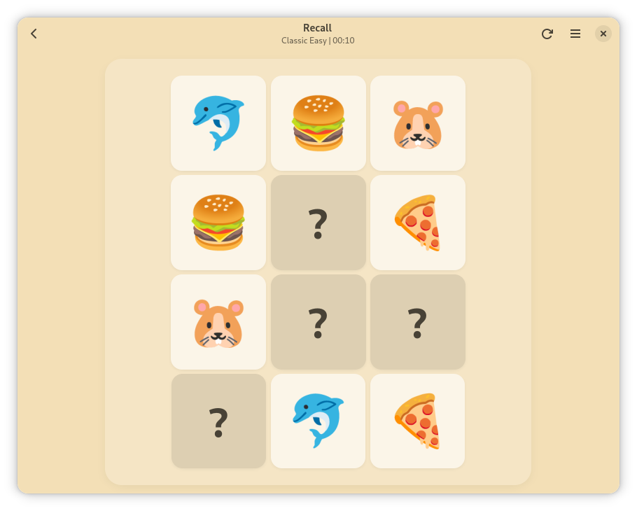

<div align="center">
  
  <h1>Recall</h1>
  <p><strong>A calm GNOME memory game made with Rust, GTK4, and libadwaita.</strong></p>
  <p>Classic, Tri, and Infinite modes with polished transitions and local records.</p>
</div>

## Preview

Classic Easy gameplay:



Demo video:

- https://youtu.be/j905L9dmyVI

## Project Goals

- Create a clean GNOME-native game experience
- Keep gameplay readable and responsive across difficulty levels
- Maintain a codebase that is easy to extend and maintain

## Game Modes

- `Classic`: pair matching with progressive difficulty (`Easy`, `Normal`, `Hard`, `Expert`)
- `Tri`: group matching variant with level-based progression
- `Infinite`: continuous rounds with escalating pressure

## Core Features

- Local score/history tracking
- Animated board transitions and victory flow
- Theme support (light and dark variants)
- Debug shortcuts for rapid gameplay testing

## Tech Stack

- Rust
- GTK4
- libadwaita
- Cairo / Pango

## Run Locally

```bash
cargo run
```

Release build:

```bash
cargo build --release
```

## Debug Mode (Optional)

Enable debug shortcuts:

```bash
RECALL_DEBUG=1 cargo run
```

In game:

- `Ctrl+N` or `Ctrl+F9`: prepare a near-win board
- `Ctrl+R`: next round (Infinite) or quick restart (other modes)
- `Ctrl+1/2/3/4`: force level by mode context

## Flatpak

Manifests:

- Local build: `io.basshift.Recall.yaml`
- Flathub submission: `io.basshift.Recall.flathub.yaml`

Local Flatpak build:

```bash
flatpak-builder --force-clean build-flatpak io.basshift.Recall.yaml
```

## Project Status

- GitHub release `v0.1.0` is published
- Flathub submission is in review

## Author

Sebastian Davila (Basshift)
