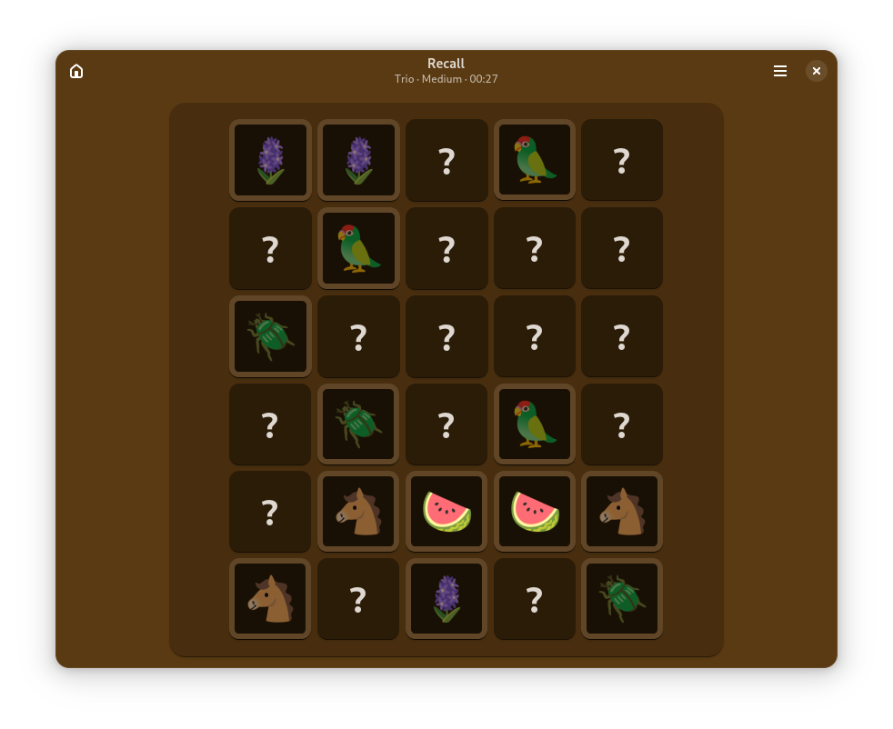

<div align="center">
  
  <h1>Recall</h1>
  <p><strong>Stay sharp under pressure</strong></p>
  <p>A stylish memory game where calm focus turns into fast pressure.</p>
</div>

Recall starts simple and readable, then steadily raises the pressure. It is designed as a polished desktop game for GNOME, with clean visuals, responsive board feedback, and three distinct ways to play.

## Preview



Video:

- https://youtu.be/j905L9dmyVI

## What Makes Recall Different

- Three modes with different pacing: `Classic`, `Trio`, and `Infinite`
- Difficulty that ramps from approachable to demanding
- GNOME-native interface with GTK4 and libadwaita
- Local records and continue-run support
- Animated transitions, victory flow, and in-app how-to guidance
- Light and dark themes

## Modes

- `Classic`: match pairs across four difficulty levels
- `Trio`: build groups of three with its own progression curve
- `Infinite`: survive increasingly intense rounds for as long as possible

## Build From Source

Run locally:

```bash
cargo run
```

Release build:

```bash
cargo build --release
```

## Flatpak

This repository includes both manifests used for packaging:

- Local development build: `io.github.basshift.Recall.yaml`
- Flathub distribution manifest: `io.github.basshift.Recall.flathub.yaml`

Local Flatpak build:

```bash
just build-flatpak-clean
```

Run the packaged app:

```bash
just run-flatpak
```

## Project Goals

- Build a memory game that feels native on GNOME
- Keep the experience readable at low pressure and exciting at high pressure
- Maintain a codebase that is practical to review, extend, and ship

## Contributing

Bug reports, usability feedback, and code contributions are welcome.

If you want to contribute:

- open an issue for bugs, regressions, or feature ideas
- fork the repository and send a pull request
- keep changes focused and easy to validate

## Credits

Developed by Sebastian Davila (Basshift)

## License

Recall is released under the MIT License. See [LICENSE](LICENSE).
